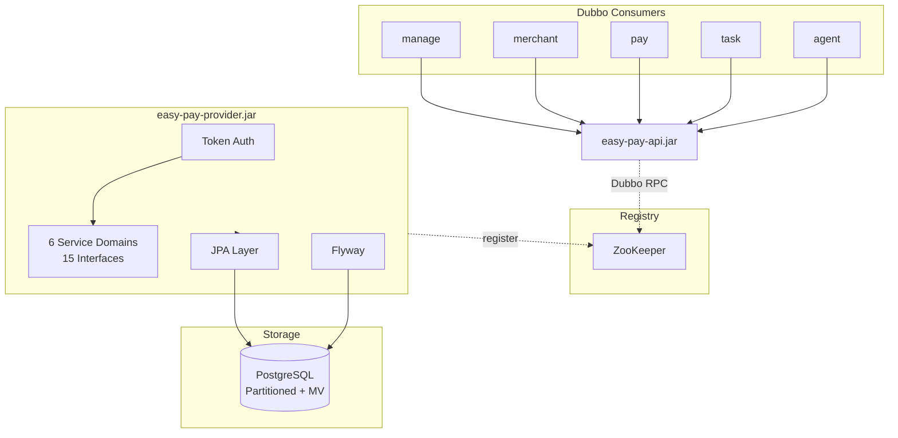

# Easy Pay Interface

Easy Pay Interface 是一个基于 Spring Boot + Apache Dubbo 的开源支付平台数据服务提供者。消费者通过 Dubbo 远程调用获取商户、支付、代理、结算、统计及系统管理能力，Provider 端采用 JPA + Flyway 管理 PostgreSQL 数据，支持 Token 认证、表分区与物化视图统计。

Easy Pay Interface is an open-source payment platform data service provider built on Spring Boot and Apache Dubbo. Consumers invoke Dubbo RPC to access merchant, payment, agent, settlement, statistics, and system management capabilities. The provider uses JPA and Flyway for PostgreSQL persistence, with Token authentication, table partitioning, and materialized view statistics.

---

## Architecture / 系统架构



---

## Tech Stack / 技术栈

| Technology | Version |
|------------|---------|
| Java | 21 |
| Spring Boot | 3.2.x |
| Apache Dubbo | 3.2.x |
| Spring Data JPA | (via Spring Boot) |
| PostgreSQL | 15+ |
| Flyway | 10.x |
| ZooKeeper | 3.8+ |
| HikariCP | 5.x |
| Maven | 3.9+ |

---

## Modules / 模块说明

| Module | Type | Description |
|--------|------|-------------|
| **easy-pay-api** | JAR (依赖) | 消费者共享接口包：DTO、Service 接口、枚举、通用返回类型 / Interface JAR for consumers: DTOs, service interfaces, enums, and result types. |
| **easy-pay-provider** | Fat JAR (部署) | 数据服务提供者：Entity、Repository、Service 实现、Flyway 迁移 / Data service provider: Entity, Repository, Service impl, Flyway migrations. |
| **easy-pay-task** | Fat JAR (部署) | 定时任务调度器（Dubbo 消费者）：订单过期、通知重试、视图刷新、自动结算 / Scheduled task runner (Dubbo consumer): order expire, notify retry, view refresh, auto settle. |

---

## Business Domains / 业务域

| Domain | Tables | Views | Interfaces |
|--------|--------|-------|------------|
| 商户管理 (Merchant) | 3 | — | 3 |
| 支付管理 (Payment) | 8 | — | 4 |
| 代理管理 (Agent) | 2 | — | 2 |
| 账户结算 (Account/Settlement) | 4 | — | 2 |
| 数据统计 (Statistics) | — | 4 MV | 1 |
| 系统管理 (System) | 7 | — | 3 |
| **Total** | **24** | **4 MV** | **15** |

---

## Materialized Views / 物化视图

统计查询完全基于 PostgreSQL 物化视图，避免实时聚合 2000 万级 `t_pay_order`：

| View | Description | Refresh |
|------|-------------|---------|
| `mv_order_stat_daily` | 每日订单统计（按日期+商户+代理+支付方式） | `CONCURRENTLY` |
| `mv_order_stat_mch` | 商户级订单汇总 | `CONCURRENTLY` |
| `mv_order_stat_way` | 支付方式级订单汇总 | `CONCURRENTLY` |
| `mv_order_stat_platform_daily` | 平台每日汇总（运营总览） | `CONCURRENTLY` |

定时任务 `DailyStatJob` 每天 00:05 自动 `REFRESH MATERIALIZED VIEW CONCURRENTLY` 刷新全部视图。

---

## Quick Start / 快速开始

### Prerequisites / 环境要求

- JDK 21+
- Maven 3.9+
- PostgreSQL 15+
- ZooKeeper 3.8+

### Option A: Docker Compose (推荐)

```bash
# 复制环境变量模板
cp .env.example .env

# 一键启动全部服务 (PostgreSQL + ZooKeeper + Provider + Task)
docker compose up -d

# 查看日志
docker compose logs -f provider
docker compose logs -f task

# 停止
docker compose down

# 停止并清除数据卷
docker compose down -v
```

### Option B: 手动构建

```bash
mvn clean package -DskipTests
```

### Configure / 配置

Configure via environment variables:

| Variable | Description | Default |
|----------|-------------|---------|
| `PG_HOST` | PostgreSQL host | `127.0.0.1` |
| `PG_PORT` | PostgreSQL port | `5432` |
| `PG_DB` | Database name | `easy_pay` |
| `PG_SCHEMA` | Schema name | `public` |
| `PG_USER` | PostgreSQL user | `postgres` |
| `PG_PASSWORD` | PostgreSQL password | `postgres` |
| `ZK_HOST` | ZooKeeper host | `127.0.0.1` |
| `ZK_PORT` | ZooKeeper port | `2181` |
| `DUBBO_PORT` | Dubbo provider port | `20880` |
| `DUBBO_TOKEN` | Dubbo token for consumer auth | `easy-pay-secret-token` |
| `TASK_ENABLED` | 定时任务总开关 (task module) | `true` |

### Run / 运行

```bash
# 启动数据服务 Provider
java -jar easy-pay-provider/target/easy-pay-provider.jar

# 启动定时任务 (独立进程)
java -jar easy-pay-task/target/easy-pay-task.jar
```

Flyway runs automatically on first provider start and migrates the schema.

---

## Database Migration / 数据库迁移

Flyway is used for database versioning. Migration scripts are under `easy-pay-provider/src/main/resources/db/migration/`.

Migration scripts (11 files, split by domain):

| Version | File | Description |
|---------|------|-------------|
| V1 | `create_common_functions.sql` | 公共触发器函数 `update_updated_at()` |
| V2 | `create_mch_tables.sql` | 商户域 3 张表 |
| V3 | `create_pay_order_tables.sql` | 支付订单 3 张表 (t_pay_order 按月分区) |
| V4 | `create_pay_channel_tables.sql` | 支付通道 5 张表 |
| V5 | `create_agent_tables.sql` | 代理商域 2 张表 |
| V6 | `create_account_tables.sql` | 账户结算 4 张表 |
| V7 | `create_sys_user_tables.sql` | 系统用户+RBAC 5 张表 |
| V8 | `create_sys_config_tables.sql` | 系统配置+日志 2 张表 |
| V9 | `create_stat_materialized_views.sql` | 4 个统计物化视图 |
| V10 | `init_pay_data.sql` | 支付方式+接口定义 |
| V11 | `init_sys_data.sql` | 系统配置+管理员 |

- **Naming**: `V{n}__{description}.sql`
- **Rule**: Never modify released migration scripts. Add new `V{n+1}__*.sql` for changes.

---

## Dubbo Token Auth / Dubbo Token 认证

The provider enables `token` for access control. Consumers must pass the same token when referencing the service. Configure `dubbo.consumer.token` or `dubbo.reference.token` to match `DUBBO_TOKEN` on the provider side.

---

## Consumer Integration / 消费者接入

**Maven dependency:**

```xml
<dependency>
    <groupId>com.easypay</groupId>
    <artifactId>easy-pay-api</artifactId>
    <version>1.0.0</version>
</dependency>
```

**Example Dubbo consumer config (application.yml):**

```yaml
dubbo:
  application:
    name: your-consumer-app
  registry:
    address: zookeeper://127.0.0.1:2181
  consumer:
    token: ${DUBBO_TOKEN:easy-pay-secret-token}
  reference:
    com.easypay.api.service.mch.IMchInfoService:
      timeout: 5000
```

---

## Project Structure / 目录结构

```
easy-pay-interface/
├── pom.xml                          # 父 POM (multi-module)
├── Dockerfile                       # 多阶段构建 (provider + task)
├── docker-compose.yml               # 一键部署编排
├── .env.example                     # 环境变量模板
├── easy-pay-api/                    # 接口模块 (消费者依赖)
│   ├── pom.xml
│   └── src/main/java/com/easypay/api/
│       ├── dto/                     # 6 域 24 个 DTO
│       ├── enums/                   # 11 个枚举
│       ├── result/                  # PageResult
│       └── service/                 # 15 个 Dubbo 接口
├── easy-pay-provider/               # 数据服务 (Dubbo Provider)
│   ├── pom.xml
│   └── src/main/
│       ├── java/com/easypay/provider/
│       │   ├── config/              # JPA、事务配置
│       │   ├── converter/           # Entity ↔ DTO 转换器
│       │   ├── entity/              # 24 个 JPA 实体
│       │   ├── repository/          # 24 个 JPA Repository
│       │   ├── service/impl/        # 15 个 @DubboService 实现
│       │   └── EasyPayProviderApplication.java
│       └── resources/
│           ├── application.yml
│           └── db/migration/        # Flyway V1~V11
├── easy-pay-task/                   # 定时任务 (Dubbo Consumer)
│   ├── pom.xml
│   └── src/main/
│       ├── java/com/easypay/task/
│       │   ├── config/              # 调度线程池、任务参数
│       │   ├── job/                 # 4 个定时任务
│       │   └── EasyPayTaskApplication.java
│       └── resources/
│           └── application.yml
├── README.md
├── LICENSE
└── CHANGELOG.md
```

---

## Contributing / 参与贡献

1. Fork the repository
2. Create a feature branch (`git checkout -b feature/your-feature`)
3. Commit your changes (`git commit -m 'Add some feature'`)
4. Push to the branch (`git push origin feature/your-feature`)
5. Open a Pull Request

---

## License / 开源协议

Apache License 2.0. See [LICENSE](LICENSE) for details.
