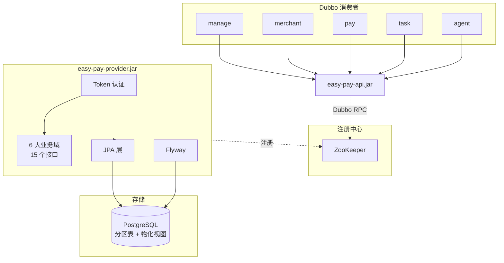

# Easy Pay Interface

Easy Pay Interface 是一个基于 Spring Boot + Apache Dubbo 的开源支付平台数据服务提供者。消费者通过 Dubbo 远程调用获取商户、支付、代理、结算、统计及系统管理能力，Provider 端采用 JPA + Flyway 管理 PostgreSQL 数据，支持 Token 认证、表分区与物化视图统计。

---

## 系统架构



---

## 技术栈

| 技术 | 版本 |
|------|------|
| Java | 21 |
| Spring Boot | 3.2.x |
| Apache Dubbo | 3.2.x |
| Spring Data JPA | (随 Spring Boot) |
| PostgreSQL | 15+ |
| Redis | 7+ |
| Flyway | 10.x |
| ZooKeeper | 3.8+ |
| HikariCP | 5.x |
| Maven | 3.9+ |

---

## 模块说明

| 模块 | 类型 | 说明 |
|------|------|------|
| **easy-pay-api** | JAR (依赖) | 消费者共享接口包：DTO、Service 接口、枚举、通用返回类型 |
| **easy-pay-provider** | Fat JAR (部署) | 数据服务提供者：Entity、Repository、Service 实现、Flyway 迁移 |
| **easy-pay-task** | Fat JAR (部署) | 定时任务调度器（Dubbo 消费者）：订单过期、通知重试、视图刷新、自动结算 |

---

## 业务域

| 域 | 表 | 视图 | 接口 |
|----|----|----|------|
| 商户管理 | 3 | — | 3 |
| 支付管理 | 8 | — | 4 |
| 代理管理 | 2 | — | 2 |
| 账户结算 | 4 | — | 2 |
| 数据统计 | — | 4 个物化视图 | 1 |
| 系统管理 | 7 | — | 3 |
| **合计** | **24** | **4 个物化视图** | **15** |

---

## 物化视图

统计查询完全基于 PostgreSQL 物化视图，避免实时聚合 2000 万级 `t_pay_order`：

| 视图 | 说明 | 刷新方式 |
|------|------|----------|
| `mv_order_stat_daily` | 每日订单统计（按日期+商户+代理+支付方式） | `CONCURRENTLY` |
| `mv_order_stat_mch` | 商户级订单汇总 | `CONCURRENTLY` |
| `mv_order_stat_way` | 支付方式级订单汇总 | `CONCURRENTLY` |
| `mv_order_stat_platform_daily` | 平台每日汇总（运营总览） | `CONCURRENTLY` |

定时任务 `DailyStatJob` 每天 00:05 自动 `REFRESH MATERIALIZED VIEW CONCURRENTLY` 刷新全部视图。

---

## Redis 缓存

高频读取的业务数据通过 Spring Cache + Redis 缓存，减少数据库查询：

| 缓存名称 | 键模式 | 过期时间 | 说明 |
|----------|--------|----------|------|
| `mch:info` | `{mchNo}` | 30 分钟 | 商户信息 |
| `mch:app` | `{appId}` | 30 分钟 | 商户应用 |
| `pay:way` | `{wayCode}` | 2 小时 | 支付方式 |
| `pay:way:list` | `{state}` | 2 小时 | 支付方式列表 |
| `pay:passage` | `{passageId}` | 2 小时 | 支付通道 |
| `pay:if:define` | `{ifCode}` | 2 小时 | 支付接口定义 |
| `pay:if:config` | `{infoType}:{infoId}:{ifCode}` | 30 分钟 | 支付接口配置 |
| `mch:passage` | `{mchNo}:{appId}:{wayCode}` | 10 分钟 | 商户可用通道 |

写操作自动通过 `@CacheEvict` 失效对应缓存。

---

## 快速开始

### 环境要求

- JDK 21+
- Maven 3.9+
- PostgreSQL 15+
- ZooKeeper 3.8+

### 方式一：Docker Compose（推荐）

```bash
# 复制环境变量模板
cp .env.example .env

# 一键启动全部服务 (PostgreSQL + ZooKeeper + Provider + Task)
docker compose up -d

# 查看日志
docker compose logs -f provider
docker compose logs -f task

# 停止
docker compose down

# 停止并清除数据卷
docker compose down -v
```

### 方式二：手动构建

```bash
mvn clean package -DskipTests
```

### 配置

通过环境变量进行配置：

| 变量 | 说明 | 默认值 |
|------|------|--------|
| `PG_HOST` | PostgreSQL 地址 | `127.0.0.1` |
| `PG_PORT` | PostgreSQL 端口 | `5432` |
| `PG_DB` | 数据库名 | `easy_pay` |
| `PG_SCHEMA` | Schema 名称 | `public` |
| `PG_USER` | PostgreSQL 用户名 | `postgres` |
| `PG_PASSWORD` | PostgreSQL 密码 | `postgres` |
| `REDIS_HOST` | Redis 地址 | `127.0.0.1` |
| `REDIS_PORT` | Redis 端口 | `6379` |
| `REDIS_PASSWORD` | Redis 密码 | （空） |
| `ZK_HOST` | ZooKeeper 地址 | `127.0.0.1` |
| `ZK_PORT` | ZooKeeper 端口 | `2181` |
| `DUBBO_PORT` | Dubbo 服务端口 | `20880` |
| `DUBBO_TOKEN` | Dubbo 消费者认证令牌 | `easy-pay-secret-token` |
| `TASK_ENABLED` | 定时任务总开关 | `true` |

### 运行

```bash
# 启动数据服务 Provider
java -jar easy-pay-provider/target/easy-pay-provider.jar

# 启动定时任务（独立进程）
java -jar easy-pay-task/target/easy-pay-task.jar
```

Provider 首次启动时 Flyway 会自动执行数据库迁移。

---

## 数据库迁移

使用 Flyway 进行数据库版本管理，迁移脚本位于 `easy-pay-provider/src/main/resources/db/migration/` 目录下。

迁移脚本（共 11 个文件，按业务域拆分）：

| 版本 | 文件 | 说明 |
|------|------|------|
| V1 | `create_common_functions.sql` | 公共触发器函数 `update_updated_at()` |
| V2 | `create_mch_tables.sql` | 商户域 3 张表 |
| V3 | `create_pay_order_tables.sql` | 支付订单 3 张表（`t_pay_order` 按月分区） |
| V4 | `create_pay_channel_tables.sql` | 支付通道 5 张表 |
| V5 | `create_agent_tables.sql` | 代理商域 2 张表 |
| V6 | `create_account_tables.sql` | 账户结算 4 张表 |
| V7 | `create_sys_user_tables.sql` | 系统用户 + RBAC 5 张表 |
| V8 | `create_sys_config_tables.sql` | 系统配置 + 日志 2 张表 |
| V9 | `create_stat_materialized_views.sql` | 4 个统计物化视图 |
| V10 | `init_pay_data.sql` | 支付方式 + 接口定义 |
| V11 | `init_sys_data.sql` | 系统配置 + 管理员 |

- **命名规则**：`V{n}__{description}.sql`
- **注意**：已发布的迁移脚本不可修改，如需变更请新增 `V{n+1}__*.sql` 文件。

---

## Dubbo Token 认证

Provider 端开启 `token` 进行访问控制，消费者引用服务时必须传入相同的令牌。在消费者端配置 `dubbo.consumer.token` 或 `dubbo.reference.token`，确保与 Provider 端的 `DUBBO_TOKEN` 一致。

---

## 消费者接入

**Maven 依赖：**

```xml
<dependency>
    <groupId>com.easypay</groupId>
    <artifactId>easy-pay-api</artifactId>
    <version>1.0.0</version>
</dependency>
```

**Dubbo 消费者配置示例（application.yml）：**

```yaml
dubbo:
  application:
    name: your-consumer-app
  registry:
    address: zookeeper://127.0.0.1:2181
  consumer:
    token: ${DUBBO_TOKEN:easy-pay-secret-token}
  reference:
    com.easypay.api.service.mch.IMchInfoService:
      timeout: 5000
```

---

## 目录结构

```
easy-pay-interface/
├── pom.xml                          # 父 POM（多模块）
├── Dockerfile                       # 多阶段构建（provider + task）
├── docker-compose.yml               # 一键部署编排
├── .env.example                     # 环境变量模板
├── easy-pay-api/                    # 接口模块（消费者依赖）
│   ├── pom.xml
│   └── src/main/java/com/easypay/api/
│       ├── dto/                     # 6 域 24 个 DTO
│       ├── enums/                   # 11 个枚举
│       ├── result/                  # PageResult
│       └── service/                 # 15 个 Dubbo 接口
├── easy-pay-provider/               # 数据服务（Dubbo Provider）
│   ├── pom.xml
│   └── src/main/
│       ├── java/com/easypay/provider/
│       │   ├── config/              # JPA、事务配置
│       │   ├── converter/           # Entity ↔ DTO 转换器
│       │   ├── entity/              # 24 个 JPA 实体
│       │   ├── repository/          # 24 个 JPA Repository
│       │   ├── service/impl/        # 15 个 @DubboService 实现
│       │   └── EasyPayProviderApplication.java
│       └── resources/
│           ├── application.yml
│           └── db/migration/        # Flyway V1~V11
├── easy-pay-task/                   # 定时任务（Dubbo 消费者）
│   ├── pom.xml
│   └── src/main/
│       ├── java/com/easypay/task/
│       │   ├── config/              # 调度线程池、任务参数
│       │   ├── job/                 # 4 个定时任务
│       │   └── EasyPayTaskApplication.java
│       └── resources/
│           └── application.yml
├── README.md
├── LICENSE
└── CHANGELOG.md
```

---

## 参与贡献

1. Fork 本仓库
2. 创建功能分支（`git checkout -b feature/your-feature`）
3. 提交更改（`git commit -m '添加某功能'`）
4. 推送到分支（`git push origin feature/your-feature`）
5. 创建 Pull Request

---

## 开源协议

Apache License 2.0，详见 [LICENSE](LICENSE)。
