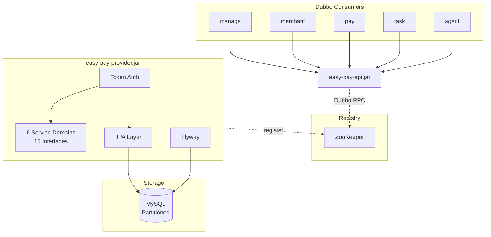

# Easy Pay Interface

Easy Pay Interface 是一个基于 Spring Boot + Apache Dubbo 的开源支付平台数据服务提供者。消费者通过 Dubbo 远程调用获取商户、支付、代理、结算、统计及系统管理能力，Provider 端采用 JPA + Flyway 管理 MySQL 数据，支持 Token 认证与表分区。

Easy Pay Interface is an open-source payment platform data service provider built on Spring Boot and Apache Dubbo. Consumers invoke Dubbo RPC to access merchant, payment, agent, settlement, statistics, and system management capabilities. The provider uses JPA and Flyway for MySQL persistence, with Token authentication and table partitioning support.

---

## Architecture / 系统架构



---

## Tech Stack / 技术栈

| Technology | Version |
|------------|---------|
| Java | 21 |
| Spring Boot | 3.2.x |
| Apache Dubbo | 3.2.x |
| Spring Data JPA | (via Spring Boot) |
| MySQL | 8.0+ |
| Flyway | 10.x |
| ZooKeeper | 3.8+ |
| HikariCP | 5.x |
| Maven | 3.9+ |

---

## Modules / 模块说明

| Module | Description |
|--------|-------------|
| **easy-pay-api** | Interface JAR for consumers. Contains DTOs, service interfaces, enums, and common result types. |
| **easy-pay-provider** | Deployable fat JAR. Contains Entity, Repository, Service implementations, Flyway migrations, and Dubbo provider configuration. |

---

## Business Domains / 业务域

| Domain | Tables | Interfaces |
|--------|--------|------------|
| 商户管理 (Merchant) | 3 | 3 |
| 支付管理 (Payment) | 8 | 4 |
| 代理管理 (Agent) | 2 | 2 |
| 账户结算 (Account/Settlement) | 4 | 2 |
| 数据统计 (Statistics) | 1 | 1 |
| 系统管理 (System) | 7 | 3 |
| **Total** | **25** | **15** |

---

## Quick Start / 快速开始

### Prerequisites / 环境要求

- JDK 21+
- Maven 3.9+
- MySQL 8.0+
- ZooKeeper 3.8+

### Build / 构建

```bash
mvn clean package -DskipTests
```

### Configure / 配置

Configure via environment variables:

| Variable | Description | Default |
|----------|-------------|---------|
| `MYSQL_HOST` | MySQL host | `127.0.0.1` |
| `MYSQL_PORT` | MySQL port | `3306` |
| `MYSQL_DB` | Database name | `easy_pay` |
| `MYSQL_USER` | MySQL user | `root` |
| `MYSQL_PASSWORD` | MySQL password | `root` |
| `ZK_HOST` | ZooKeeper host | `127.0.0.1` |
| `ZK_PORT` | ZooKeeper port | `2181` |
| `DUBBO_PORT` | Dubbo provider port | `20880` |
| `DUBBO_TOKEN` | Dubbo token for consumer auth | `easy-pay-secret-token` |

### Run / 运行

```bash
java -jar easy-pay-provider/target/easy-pay-provider.jar
```

Flyway runs automatically on first start and migrates the schema.

---

## Database Migration / 数据库迁移

Flyway is used for database versioning. Migration scripts are under `easy-pay-provider/src/main/resources/db/migration/`.

- **Naming**: `V{n}__{description}.sql` (e.g. `V1__init_schema.sql`, `V2__init_data.sql`)
- **Rule**: Never modify released migration scripts. Add new `V{n+1}__*.sql` for schema or data changes.

---

## Dubbo Token Auth / Dubbo Token 认证

The provider enables `token` for access control. Consumers must pass the same token when referencing the service. Configure `dubbo.consumer.token` or `dubbo.reference.token` to match `DUBBO_TOKEN` on the provider side.

---

## Consumer Integration / 消费者接入

**Maven dependency:**

```xml
<dependency>
    <groupId>com.easypay</groupId>
    <artifactId>easy-pay-api</artifactId>
    <version>1.0.0</version>
</dependency>
```

**Example Dubbo consumer config (application.yml):**

```yaml
dubbo:
  application:
    name: your-consumer-app
  registry:
    address: zookeeper://127.0.0.1:2181
  consumer:
    token: ${DUBBO_TOKEN:easy-pay-secret-token}
  reference:
    com.easypay.api.service.mch.IMchInfoService:
      timeout: 5000
```

---

## Project Structure / 目录结构

```
easy-pay-interface/
├── pom.xml
├── easy-pay-api/
│   ├── pom.xml
│   └── src/main/java/com/easypay/api/
│       ├── dto/           # DTOs by domain
│       ├── enums/         # Enums
│       ├── result/        # PageResult, etc.
│       └── service/       # Interface definitions
├── easy-pay-provider/
│   ├── pom.xml
│   └── src/main/
│       ├── java/com/easypay/provider/
│       │   ├── config/
│       │   ├── converter/
│       │   ├── entity/
│       │   ├── repository/
│       │   ├── service/impl/
│       │   └── EasyPayProviderApplication.java
│       └── resources/
│           ├── application.yml
│           └── db/migration/
│               ├── V1__init_schema.sql
│               └── V2__init_data.sql
├── README.md
├── LICENSE
└── CHANGELOG.md
```

---

## Contributing / 参与贡献

1. Fork the repository
2. Create a feature branch (`git checkout -b feature/your-feature`)
3. Commit your changes (`git commit -m 'Add some feature'`)
4. Push to the branch (`git push origin feature/your-feature`)
5. Open a Pull Request

---

## License / 开源协议

Apache License 2.0. See [LICENSE](LICENSE) for details.
